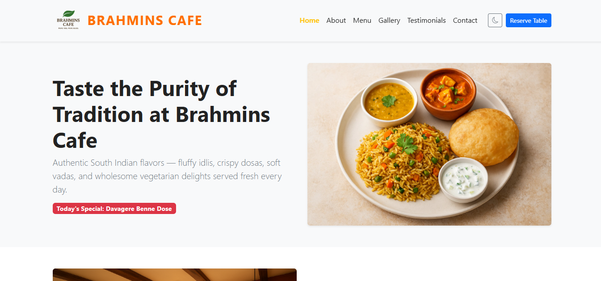
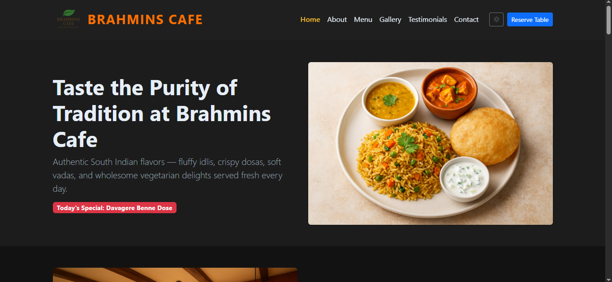
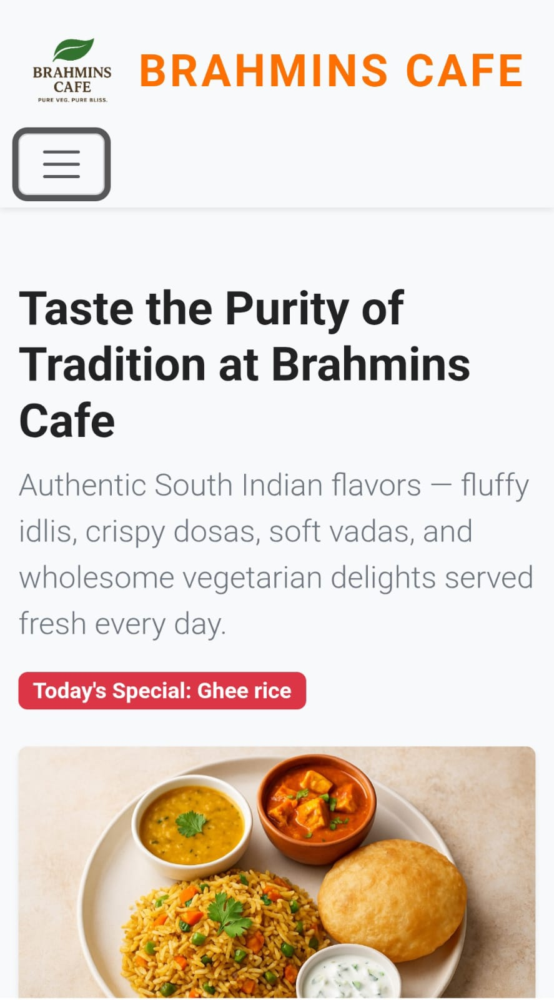
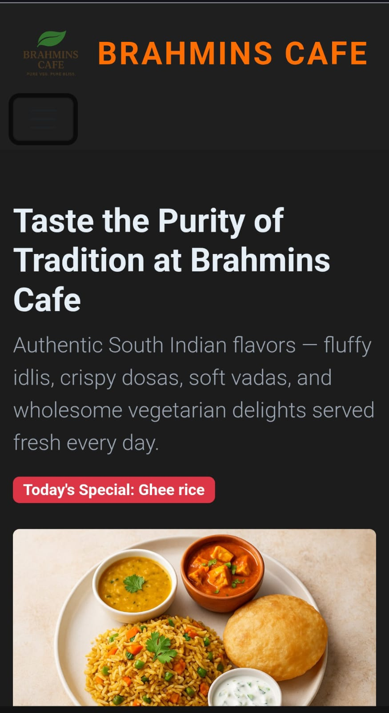
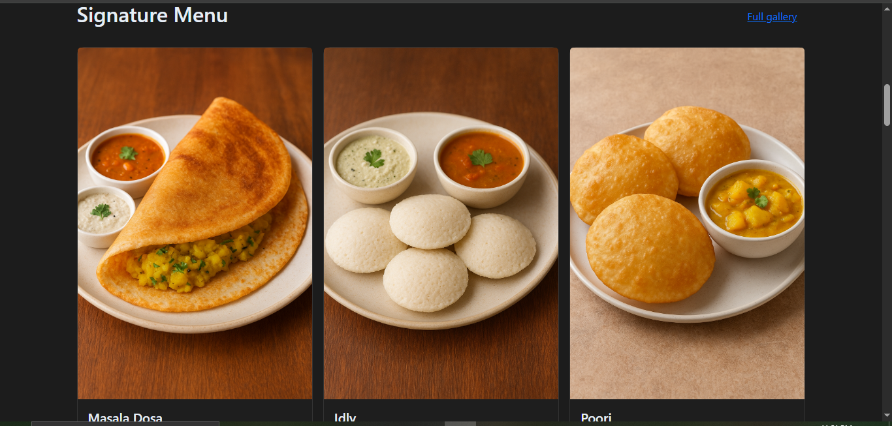
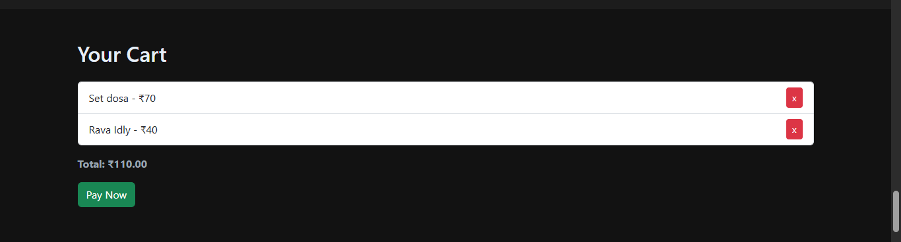
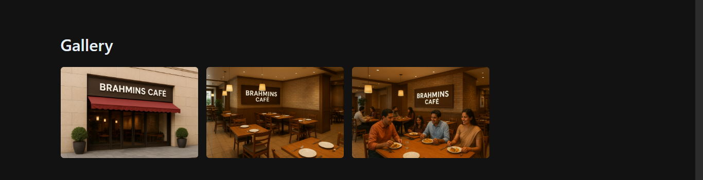
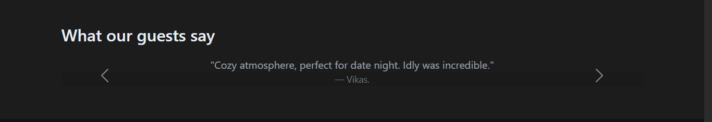
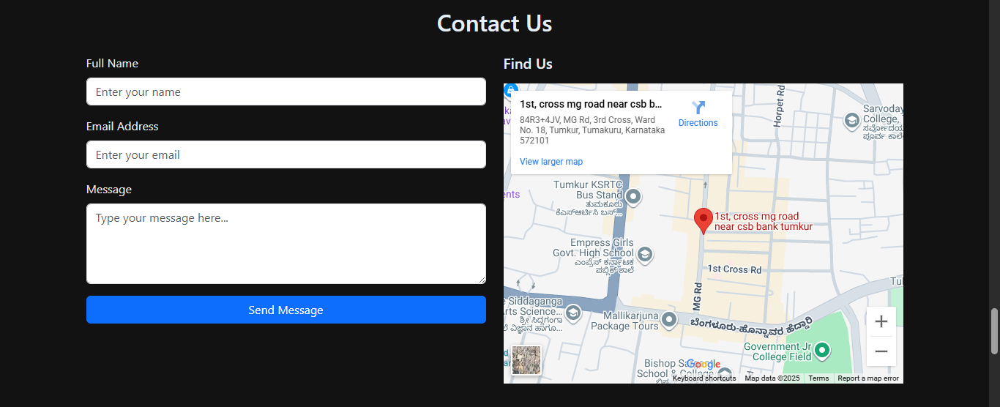
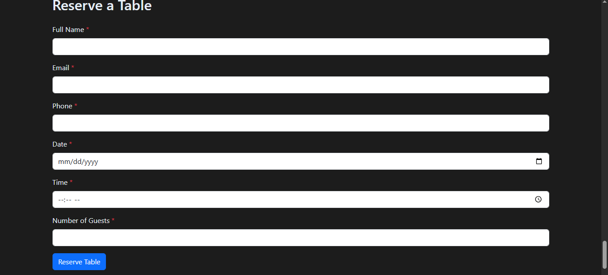

# 🍽️ Pure Veg South Indian Restaurant Website

A responsive restaurant website built with **HTML, CSS (Bootstrap 5), and JavaScript**.
Includes dark mode toggle, today’s special badge, cart functionality, reservation form, contact form, and lightbox gallery.

---

## ✨ Features

* 🥗 **Interactive Menu** with add-to-cart and "Pay Now" flow
* 🛒 **Cart Toast Notifications** for add/remove/payment
* 🌙 **Dark Mode Toggle** with persistence (localStorage)
* ⭐ **Today’s Special** badge updates daily
* 📸 **Image Gallery with Lightbox**
* 📅 **Reserve Table Form** with validation
* 📬 **Contact Form** with instant feedback
* 📍 **Reach Us & Find Us** section
* 📱 **Fully Responsive (Mobile, Tablet, Desktop)**

---

## 📷 Screenshots

### 💻 Desktop View(Light Mode)



### 💻 Destop Viw(Dark Mode)



### 📱 Mobile View(Light Mode)




### 📱 Mobile View(Dark Mode)




### Menu




### Cart




### Gallery




### Testonomials




### Contact




### Reserve a table



---

## 🚀 How to Run Locally

1. Clone this repo or download the files.

   ```bash
   git clone https://github.com/yourusername/restaurant-website.git
   cd restaurant-website
   ```

2. Open `index.html` in your browser.

   * No server needed — it’s pure **HTML/CSS/JS**.
   * For a smoother dev experience, use VS Code’s **Live Server extension**.

---

## 🛠️ Tech Stack

* HTML5
* CSS3 (Bootstrap 5 + Custom Styles)
* Vanilla JavaScript

---

## 📱 Responsiveness

This project is designed to be **mobile-first**:

* Navbar collapses into hamburger menu
* Cart & forms scale nicely on smaller screens
* Images auto-resize
* Dark mode & toasts work on all devices

---

## 📄 License

MIT License – feel free to use and modify.
